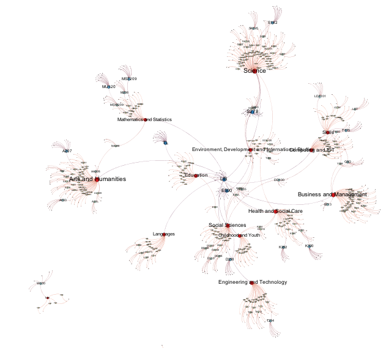
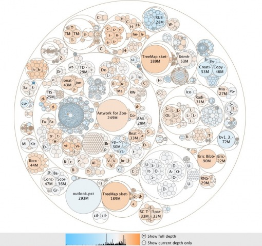
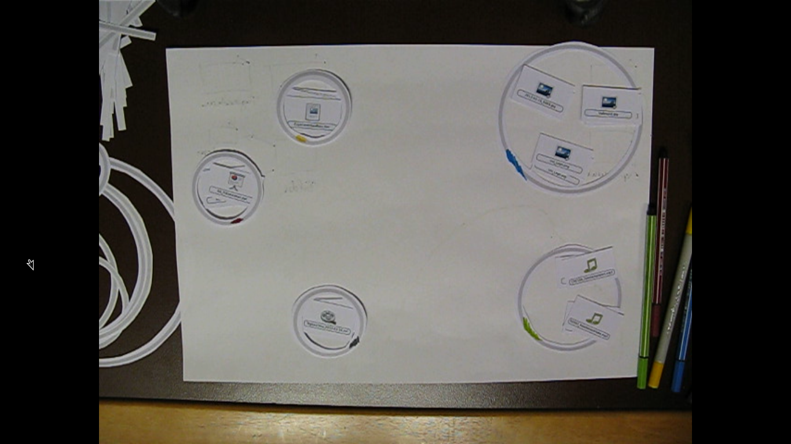
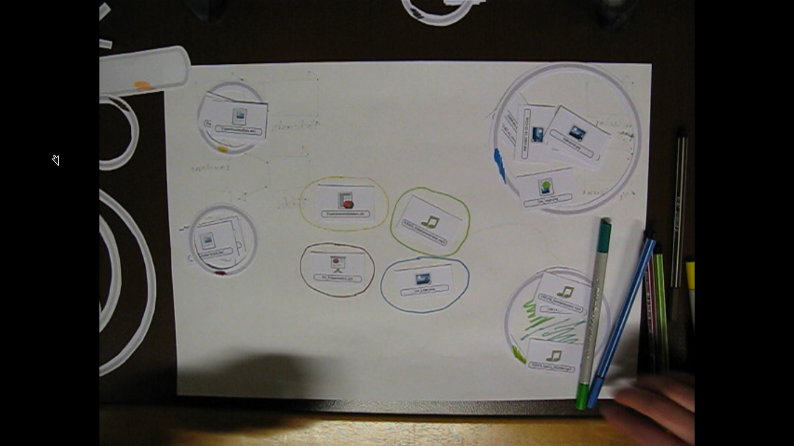

latex input: mmd-beamer-IntSysTheme-header
Title: File Network: Strukturdesign
Author: Anastasia Kazakova, Bengt Lüers
latex mode: beamer
LaTeX XSLT: beamer
Theme: keynote-IntSysTheme
latex input: mmd-natbib-plain
latex input: mmd-beamer-begin-IntSysTheme-doc
latex footer: mmd-beamer-IntSysTheme-footer

# #

## Erarbeiten des Strukturdesigns

### Schritt eins

**Brainstorming**

-   Kreise
-   Farben
-   Venn-Diagramme

**State of the Art**

-   Informationsvisualisierung
-   Bäume
-   Graphen

### Schritt eins: Beispiel 1

### Schritt eins: Beispiel 2

### Schritt eins: Beispiel 3

### Schritt zwei

**Frag mal die Anderen**

-   Bunte Stifte
-   Einige Elemente
	-   Kreise
	-   Tags
	-   Verbindungen
-   Aufgaben

## Kunststunde

### Ziele

-   Ideen sammeln
-   Schauen, wie unsere Ideen ankommen
-   Entdecken neuer Blickwinkel

### Vorgehen

-   6 Aufgaben
-   2 Aufbaus
	-   Dateikärtchen
	-   Papier
	-   Stifte

	-   Papierelemente
		-   Kreise
		-   Tags
		-   Verbindungen

### Ideen (1/2)

### Ideen (2/2)

### Ergebnisse

**Überschneidungen**

-   Kreise sind toll
-   Farben spielen eine Rolle

**Neue Ideen**

-   Wichtiges/Aktuelles in die Mitte
-   Unwichtiges/veraltetes an den Rand

**Wünsche**

-   Aufräumknopf
-   dynamische Anpassung des Dateisystems an Nutzung

### Emotionales Feedback

-   Farbe hat hohen Symbolwert
-   Verwahrlosung vermeiden
	-   durch Gestaltungsraum
	-   durch maschinelle Unterstützung
-   hohe Bereitschaft sich vom System helfen zu lassen
-   großes Problembewusstsein
-   Aussicht auf bessere Welt

## Strukturdesign

### Konzepte

**Wir arbeiten mit**

-   Kreisen
-   Farben
-   Entfernung zur Bildschirmmitte als Aktualitätsindikator
-   Maschinelles Lernen

### So könnte es aussehen

### Danke!

**Fragen?**

