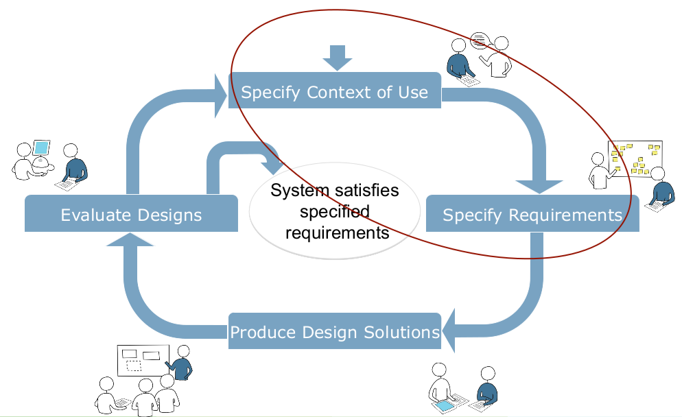
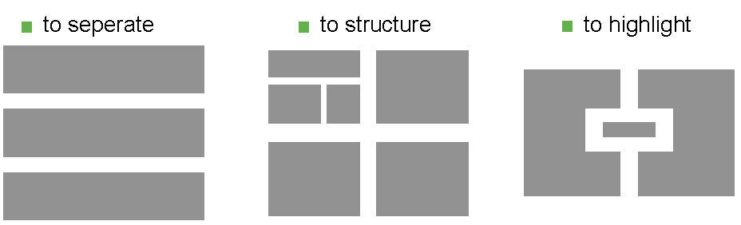
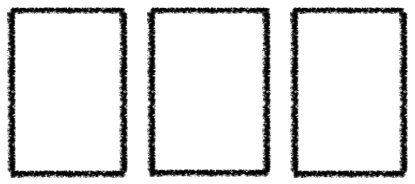
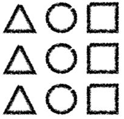
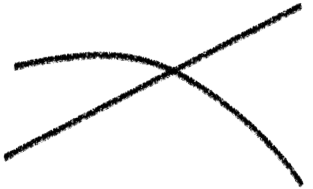
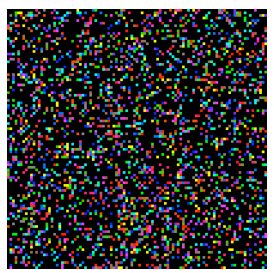

# Interaktive Systeme

## 1 - Übersicht über die Veranstaltung

Vorlesung

-   Zusammenfassung im Folgenden

Projekt

-   Praktische Umsetzung eines interaktiven Systems
-   Verwendung eines Nutzerorientierten Ansatzes
-   Umsetzung auf Basis des Prototyping-Werkzeugs Pidoco

Abschlusspräsentation

-   fasst Projekt zusammen

Abschlussgespräch

-   a.k.a. mündliche Prüfung

## 2 - Die geschichtliche Entwicklung des Feldes HCI

Grober Verlauf

-   Use the Machine
    -   design was engineering design:  
        make faster, bigger machines, expose their guts through controls
    -   people adapt to the machines
    -   people speak the language of the machines
    -   elaborate efforts to prepare problems for the machines
    -   no designers involved, but lots of clever engineers  
        &rArr; emergence of a new set of skills, new disciplines
    -   in the meantime, the field of human factors is blooming  
        (along with things like “aviation psychology”)

-   Use the Software
    -   shift in focus
        -   from controlling the computer
        -   to using applications and tools
    -   trying to make it so people have to adapt less to use the machines
    -   design is still done mostly by engineers, few specialists
    -   still mostly thought of as “computer human factors”
-   Perform a Task

    -   wordstar was so complex yet so popular,  
        it invited both complaint and competition
    -   the success of Lotus 1-2-3 over Visicalc
        -   was partly due to ease of use and appropriate power
        -   and its enterprise-penetrating platform, the IBM PC
    -   its use in large companies led to an emphasis
        -   on ease of learning,
        -   ease of use,
        -   reduced errors,
        -   saved time
    -   this eventually led to a professional emphasis on people doing a task rather than “a tool with good controls”

-   Experience
    -   after twenty years of trying to help people perform tasks,  
        we realized success depended on expanding the scope of view
    -   most good work now involves an effort to fit  
        context of use, characteristics of individuals, patterns of life
    -   most good work now attempts to go beyond expressed need  
        to latent or masked needs

-   Connect
    -   we are used to designing for individuals
    -   we’re learning to account for differences in individuals.  
        But the machines often stay most prominent
    -   now, more often, the machines fade to the background  
        we design for what happens between people *through* the machines
    -   we enable people to build things together through the machines  
        the construction is in the foreground, not the technology
    -   and now we are learning to account for variations in groups, genres of connections

-   Dynamically Enable

    -   some are beginning to imagine (and work toward) a day
        when we complete the shift...
        -   from “we adapt to the machines”
        -   to “our environment and tools adapt to us as we move through life”
    -   the best examples have yet to be imagined, but here are two I’ve heard mentioned, just so you get the idea:
    -   why do I have to convert this to pdf format to share it with you? why doesn’t the act of sharing imply some sort of conversion from authoring format to reading format?
    -   I like to listen to “Morning Edition” on the radio in the mornings. Why shouldn’t the broadcast follow me from bathroom to bedroom to kitchen, then into the car?

Quelle: <http://www.slideshare.net/mrettig/interaction-design-history>

## 3 - Beispiel: OLB Baufinanzierung

### Ansätze

1.  Interview mit Stakeholdern
2.  Paper-/Wireframe-Prototyping
3.  Open Card Sorting

### Iterative Design Phase

1.  Cognitive Walkthrough
    -   Klick für Klick
2.  Usability-Test
    -   Eyetracking

### Summary

-   Ideas for a user oriented information architecture:  
    structure and word choice
-   Feedback and ideas for concrete design ideas
-   Rework of initial requirements
-   Further insights into the subjects‘ mental model
-   Very early and frequent user studies help to  
    constantly adjust the UI design to the user‘s needs
-   Wireframe evaluation revealed  
    weaknesses in the designed information structure
-   Open Card Sorting was very helpful for understanding  
    the users‘ mental model of website and of construction financing in
    general
-   Expert and User Evaluations revealed  
    usability weaknesses and points of drop out

## 4 - User Requirements

### Was macht Projekte erfolgreich?

-   User Involvement
-   Clear Statement of Requirements

### Context of Use Analysis

Die Beschreibung des *Context of Use* ist ein Arbeitsdokument und gehört üblicher Weise zur *User Requirements Specification*. Es um fasst Folgendes:

-   Benutzer- und Stakeholder-Gruppen
    -   Wer wird das System benutzen?
    -   Wer außerdem davon betroffen?
    -   Welche Charakteristiken haben diese Gruppen?
-   Eigenschaften von diesen Gruppen
    -   Wissen, Fähigkeiten, Erfahrung, Bildung, Ausbildung
    -   Physische Fähigkeiten, Gewohnheiten, Vorlieben, Vermögen
-   Ziele und und Aufgaben von Nutzern und dem System
    -   Art, auf die Aufgaben typischer Weise ausgeführt werden
    -   Häufigkeit und Dauer, Interdependenzen und parallel ausgeführte
        Aufgaben
    -   Gefahren, Auswrikungen auf Sicherheit und Gesundheit
-   Umgebung des Systems:
    -   technisch: Hardware, Software
    -   physikalisch: Wetter, Beleuchtung, ...
    -   sozial: Arbeitsweisen, Organisationsstrukturen, Einstellungen

### User Requirements Specification

The user requirements specification includes following information

-   The intended context of use
-   Requirements derived from user needs and the context of use
-   e.g. specific requirement for the a product to be used outdoors
-   Requirements arising from relevant ergonomics and user interface
    knowledge, standards and guidelines
-   usability requirements and objectives, including measurable usability
    performance and satisfaction criteria in specific contexts of use
-   Requirements derived from organizational requirements that
    directly affect the user
   
### Methoden zum Analysieren der User Requirements

interative

-   Data gathering activities
-   Data analysis activities
-   Expression as context description and requirements

#### Fragebögen

-   Sequenz von Fragen zum Erheben von quantitativen oder qualitativen Daten.
-   Oft aus Statistische Analyse ausgelegt.

Online Umfragen

-   sind *sehr* effizient
-   Schränken Benutzerkreis ein

Beispiele für Fragetypen

-   Ja/Nein
-   Check-Boxen
-   Likert-Skalen (z.B. 5 oder 7 Stufen)
-   Offene Fragen
-   Grad an Zustimmung zu Aussagen

Vorteile

-   Zeit- und Kosteneffizient
-   Inhaltlich frei
-   Relativ fehlerfrei wenn standardisiert
-   Einfach zu verwalten

Nachteile

-   Ergebnis hängt stark vom Befragten ab
-   Vorauswahl durch eventuell nicht repräsentative Teilnehmer

### Interviews

Strukturiertheit

-   Offen  
    hohe Abhängigkeit vom Können des Interviewers
-   Semi-strukturiert
-   Strukturiert  
    weniger Kontextinformationen, einfacher zu interpretieren

Beispiele

-   Interview users about users’ music listening habits
-   Interview tourists information office employees about bicycle tourists issues
-   Would you want to carry mobile devices in your household?
-   How much would users/you pay for a new system that reminds you to take
your medicine?

Vorteile

-   Einfach, effizient und praktisch
-   Zugriff auf schwierig zu beobachtende Werte  
    Gefühle, Emotionen, Eindrücke
-   Hohe Validität
    Bedeutung hinter Aktionen können erfasst werden
-   Nachfragen und Erläutern komplexer Fragen möglich
-   Einfach aufzunehmen

Nachteile

-   Abhängig vom Können des Interviewers
-   Interviewer könnte Antworten beeinflussen
-   Zeitaufwändig und teuer
-   Nicht sehr verlässlich
-   Ergebnisse sind schwierig zu verallgemeinern und zu generalisieren
    zumindest, wenn das Interview unstrukturiert war
    
### Zielgruppen

Gruppentreffen

-   6 – 12 Teilnehmer
-   Konzentration auf ein Thema durch Gruppendiskussion
-   Heterogenität ist nützlich,
    aber nicht über Hierarchien oder bei gegensätzlichen Ansichten
    
Vorbereitung

-   Zeit einplanen (1–3 Stunden)
-   Fragen vorbereiten (4–10)
-   TN einladen und Ziele erklären
-   Material bereitstellen

Beispiele

-   Ideen für Produktverbesserung erzeugen
-   Kandidaten für ein Produktdesign vergleichen
-   Hypothesen für eine Folgestudie entwerfen

Auswahl von Teilnehmern für eine Fokusgruppe

-   produktive Balance zwischen langweiliger Ähnlichkeit und konfliktierender Unterschiedlichkeit
-   Keine Leute aus unterschiedlichen Hierachiestufen der selben Firma 
-   Keine Leute mit radikal unterschiedlichen Ansichten

Verschiedene Fokus Gruppen für verschiedene Blickwinkel

-   Männer und Frauen
-   Manager und Verkäufer

Erwartete Gruppendynamik sollte konstruktive Diskussion erlauben

Planen einer Fokus Group Diskussion

-   einmalig oder mehrmaliges Treffen
-   jeweils 1 - 3 Stunden
-   Audio-Aufnahme
-   4 - 10 Fragen  
    die Gruppendynamik provozieren
-   einzelne Einladungen  
    mit Erklärung des Konzepts
-   Diskussionsgegenstand anfassbar machen
    Demo vorbereiten, Prototypen bereitstellen

Ablauf

1.  Moderator keeps the group focused and the discussion moving
2.  Start with an introduction and provide name tags to participants
3.  Explain the rules of the discussion (e.g. confidentiality)
4.  Start with simple non-controversial questions
5.  Pose open-ended questions
6.  Avoid question that lead to specific answers
7.  Allow for diverse opinions and for equal opportunities in the discussion
8.  Encourage each participant to express their own point of view
9.  Consensus between participants is not required
10.  Capture or record the session (video, audio, note taking)

Vorteile

-   Breit gestreute und qualitative Informationen
-   Tiefgreifende Informationen
-   Zeigt Common Sense und Konfliktpotenzial auf
-   Möglichkeit, Ähnliche Themen anzuschneiden oder zu vertiefen
-   Günstig und einfach

Nachteile

-   Teilnehmer sind nicht repräsentativ
-   Rolle des Moderators ist groß  
    kann Resultate beeinflussen
-   Einzelne Teilnehmer können dominieren
-   Nicht quantitativ
-   Schwer zu verallgemeinern

### Ethnographische Studien

Bei Ethographischen Studien begibt man sich in die Umgebung der Benutzer und nimmt am täglichen Leben teil.

Ansatz

-   Wichtigkeit von gewohnten Aktionen ist schwer einzuschätzen
-   als trivial empfundene Aktionen werden in anderen Methoden nicht
    kommentiert

Methode

-   Beobachtung von Menschen in *natürlicher Umgebung*  
    Supermarkt, zu Hause, bei der Arbeit, ...

Ziel

-   implizites Wissen aufdecken
-   Verhalten verstehen

Vorgehen

-   Aufzeichnungen  

Beispielaspekte

-   Who is present (what is their role?)
-   What is happening?
-   When does the activity occur
-   Where is it happening?
-   Why is it happening
-   How is the activity organized?

#### Pen&Paper

-   Cheap and easy but unreliable
-   Make structured observations sheets/tool

#### Audio/video Recording

Capturing behavior and context with cameras

-   Including audio & still picture
-   Provide moving pictures of regions important to task
-   Provide information about the user context

Following a user with a camera

-   Cheap and easy
-   Captures everything, even details you haven’t considered before your observation
-   Can be obtrusive, which might lead to behavior change user behavior when the subject feels be observed obtrusively
-   Attracts attention of passing-by peoples and might change their behavior

Camera attached to the user may be useful

-   Many cameras = many perspectives = many information
-   Neck-lace camera, camera embedded into glasses, etc.
-   Allow the observer to see “through the eyes” of the user
-   Good for review/discussion with the user

Analysis of raw material is very time consuming!

-   Up to 20h for 1h recording
-   Automatically annotate video recordings  
    (E.g. time stamps, possibly triggered by events)
-   Creates lots of data, potentially expensive to analyze

#### Sensor Based Recording

Bsp. and Bewegungssesnoren, Lagesensoren

Sensors

-   Provide a truly objective measure
-   Sensors are everywhere  
    (think about mobile phones, sensors in home automation, etc.)
-   Sensors emerge into the background (i.e., they are pervasive), thus they
are quite unobtrusive

Examples

-   GPS (location, orientation, ...)
-   Accelerometer (activity, device posture, ...)
-   Microphone (environmental noise level, ...)
-   Camera (is the user looking on the display, ...)
-   Key-/Touch-Logger (interaction patterns, ...)
-   Device State (which App is running, charging, ...)
-   Etc.

Analysis

-   Analysis (e.g. identify clusters, ...)
-   Display to the experimenter (for visual analysis)
-   Display to the observed person (and let them comment)
-   Combine with other observation techniques:
    Get me all video excerpts, where users have to input a password

#### Computer logging

-   Reliable and accurate
-   Limited to actions on the computer
-   Include functionality in the prototype/product

#### Tagebuch

Methode

-   Request to user to keep a diary style protocol

Inhalt

-   Informationen zu Ort, Zeit, was passiert ist
-   Alternativ zum Schreiben:  
    Diktiergerät, Kamera, E-Mail-Adresse, ...
-   Hinterher intensives Interview

Conducting Diary Studies

-   Provide participants with pen and paper to record their entries
-   Provide participants with alternative means to record data  
    eMail address, voice recorder, photo camera, camcorder
-   Provide a semi-structured format for recording entries
    -   Highly structured formats can prevent recording unanticipated events
    -   Unstructured formats might confuse: „How should I record my events?“
-   Diary study should be followed up by in-depth interviews with participants

Pros

-   Cheaper then location based ethnography
-   Long term observation
-   Very good to investigate context of use

Cons

-   Depends on the users motivation  
    (might decrease early)
-   Hard to find out, if diary is complete or what is missing  
    (not very reliable)

### Task Analysis

-   Möglichkeiten für neue Produkte finden
-   Task-decomposition: abstraktere Aufgaben in Teilaufgaben unterteilen

### Studien durchführen

-   Informationsblatt und Einverständniserklärung sind wichtig
-   Guidelines:
    1.  Wünsche des Stakeholders erfassen
    2.  Alle Stakeholder beachten
    3.  Mehr als einen Repräsentaten jeder Stakeholder-Gruppe
    4.  Datenerhebungstechniken kombinieren
    5.  Unterstützung durch Prototypen oder Aufgabenbeschreibungen
    6.  Pilotstudie durchführen
    7.  Daten aufnehmen
    8.  Zeitnah mit der Interpretation beginnen
    9.  Interpretation vor der Analyse (WTF?!)

### Anforderungsspezifikation

### Personas

-   Fiktionale Repräsentation eines typisches Nutzers
-   Hintergrundinformationen aus Literatur, Interviews, Beobachtungen,
    Statistiken
-   Repräsentativ aber nicht durchschnittlich

### Szenarien

Erzählerische Beschreibung eines Anwendungsfalls, betrachtet dabei auch
den Kontext des Benutzers.

### Anwendungsfälle

Aus dem Software Engineering, Interaktion mit der Funktionalität eines
Systems.

### Vorwissen

### State of the Art Analysis

Vergleich von existierenden Systemen.

### General Design Principles

Beispiele:

-   Shneiderman‘s „Eight Golden Rules of Dialog Design“
-   ISO9241: Accessibility and Usability
-   Mayhew‘s General Principles of User Interface Design
-   IBM‘s Design Principles for tomorrow
-   Platform guidelines
-   Corporate Design guidelines

## UI Structure and Design

### Einführung

### Zielgruppe

-   Demographische Einschätzung (Alter, Geschlecht, Ort, Bildung,
    Arbeit, Einkommen, Hobbys, Ausstattung, ...)
-   Einschätzung nach Erfahrung und Verhalten (Anfänger,
    Fortgeschritten, Experte, ...)

### Ziele

-   Ziele der Anwendung (Unterhaltung, Bildung, Büro, Verwaltung,
    Kommunikation, Information, ...)
-   Ziele der Benutzer (Wissen erlangen, einen Freund erreichen, ein
    Problem lösen, ein Dokument erstellen, ...)

### Inhalt

-   ???

### Strukturdesign

### Struktur

-   Hierarchien sind einfach
-   Ordnen nach Wichtigkeit, Granularität, Erwartungen, Bedürfnissen
-   Lieber in die Breite als in die Tiefe gehen
-   Maximale Tiefe: 5–6 Level

### Ausrichtung und Navigation

-   Benutzerfragen:
    -   Wo bin ich? $\rightarrow$ Brotkrumen-Navigation
    -   Was kann ich tun? $\rightarrow$ Beware the big button trap (???)
    -   Was passiert wenn ich dies tue?
    -   Wo komme ich her? / Wie komme ich zurück?
-   Visuelles (Farben, Schriften, Bilder und Symbole) sollten einfach
    leicht zu merken sein
-   Ein Menü ist gut für Navigation und Orientierung
-   Weißraum: Trennt Informationen, hebt hervor

### Card Sorting

-   Man fragt die Benutzer, wie sie Inhalt strukturieren und benennen
    würden
-   Dabei werden Muster (=*Mentale Modelle*) gesucht
-   Gut geeignet für Menü-Kategorien und Navigation
-   Methode:
    -   Inhalt vorauswählen, auf ähnliche Granularität (Detaillevel)
        achten
    -   Ungefähr 30 Karten
    -   Kurze, schnell zu lesende aber aussagekräftige Begriffe
    -   Freie Karten um Begriffe zu ergänzen
-   Durchführung:
    -   Teilnehmer sollten repräsentativ sein
    -   TN einzeln (15–30 TN) oder in 5 Gruppen à 3 TN
    -   Material: beschriftete und freie Karten, Stift, Gummibänder,
        Büroklammern, Klebstoff
    -   Am Anfang Einführung geben, dann beobachten
-   Analyse:
    -   Muster durch Ordnung auf dem Tisch, am Whiteboard, ...
    -   Unterschiede deuten auf fehlendes oder falsches Verständnis hin
    -   Methoden: Multidimensional Scaling, Hierarchical Cluster
        Analysis

### Bildschirmdesign und -layout

### Gestaltgesetze

-   Köhler, Koffka, Werheimer (Berliner Schule), 1912:
    Gestaltpsychologie
-   Basiert auf Wahrnehmung, Bewegung, Gedächtnis, Denken, Lernen und
    Verhalten
-   Insgesamt über 100 Gesetze

1.  Prägnanz: Einfache Formen 
2.  Nähe: Beieinander liegende Objekte sind zusammengehörig
    
3.  Geschlossenheit: Fenster-Metapher 
4.  Ähnlichkeit: Ähnliche Formen gehören zusammen
    
5.  Gute Fortsetzung: Kontinuierliche Formen gehören zusammen
     
6.  Erfahrung: Neue Informationen werden in bekannte Strukturen
    eingeordnet 
7.  Gemeinsame Bewegung: 

### Farben

-   Farben sind nie neutral, können Emotionen hervorrufen und sind oft
    unterbewusst wahrgenommen
-   Einflüsse: Biologisch, Kulturell, Individuell
-   Benachbarte Farben beruhigen
-   Komplementäre Farben erzeugen Spannung
-   Maximal 4–5 Farben benutzen
-   Farben konsistent benutzen

### Bilder und Symbole

-   Illustration, Dekoration, Strukturierung
-   Bilder
    -   sparen Platz,
    -   sind leicht zu erkennen,
    -   Sprachunabhängig,
    -   einfach zu merken,
    -   unterbewusst wahrnehmbar
-   Gute Bilder
    -   zeigen nur das wichtigste,
    -   kombinieren Bekanntes mit Neuem
    -   sprechen Emotionen an

### Typographie

-   strukturiert und hebt hervor
-   beinhaltet Schriftart, Schriftschnitt, Größe, Farbe und Dekoration

### Keep in Mind

Think from a user’s perspective

-   When, where and how will they use the system?
-   What are their characteristics?
-   Are they handicapped?
-   What do they expect?
-   What are they accustomed to?
-   What do they like?

Design for the actual users

## Gedächtnis und Aufmerksamkeit

-   Geteilte Aufmerksamkeit: Auf alles gleichzeitig achten (z.B.
    Autofahren)
-   Selektive Aufmerksamkeit: Konzentration auf einzelnes
-   Methoden:
    -   Eyetracking
    -   Saliency Maps (Aufmerksamkeitskarten)

## Affordance, Constraints, Models und Metaphern

### Affordanzen

-   Angebotscharakter: “An affordance is a quality of an object, or an
    environment, which allows an individual to perform an action.”

-   Beispiel: Türen

### Mappings

-   Verbindung zwischen Userinterface und echter Welt
-   Gut: physikalische Analogie, kulturelle Standards
-   Beispiele: räumlich, wahrnehmbare Analogien (Schalter sieht genauso
    aus, wie das, was er bedient)

### Constraints

-   Einschränkungen sind das Gegenteil von Affordanzen und können diese
    Vergrößern
-   Ziel: Benutzungsfehler vermeiden, Information, die erinnert werden
    muss, reduzieren
-   Arten:
    -   Physikalisch: Schränken physische Operationen ein, z.B. durch
        eine Form
    -   Semantisch: Sich aus dem Kontext und dem Wissen über die Welt
        ergebene Einschränkungen
    -   Logisch: Das, was logisch erscheint
    -   Kulturell: Farben oder Schriften-abhängig

### Konzeptuelle Modelle

-   Modelle sorgen dafür, dass nicht über jede Handlung nachgedacht
    werden muss, sondern Dinge automatisch erledigt werden können.

### Metaphern

-   Ein Bekannter Begriff wird als Analogie zu einem unbekannten
    Sachverhalt verwandt
-   Gefahr der Unter-/Überschätzung des Systems durch zu genaue Analogie
-   Reduktion auf Kernmerkmale

## Usability Guidelines

-   Definition: “The extent to which a product can be used by specified
    users to achieve specified goals with effectiveness, efficiency and
    satisfaction in a specified context of use.” [ISO 9241-11]
-   Unterschied: Effektivität (ein Ziel erreichen) und Effizienz (ein
    Ziel mit minimalem Aufwand erreichen)
-   Leaky Pipe Metaphor: Auf dem Weg zum Ziel werden Benutzer verloren
    (“Drop outs”), weil sie das Interface nicht richtig bedienen
-   Vorteile guter Usability:
    -   gesteigerte Produktivität
    -   Glückliche Benutzer
    -   Weniger Kosten (Zeit, Geld, Gesundheit) (?)
-   Es gibt Theorien, Prinzipien und Richtlinien (abstrakt nach
    konkret):

## Theorien

-   Kognition: GOMS, ACT-R
-   Sinne: Sehen, Hören, Fühlen
-   Bewegung: Fitts’ Law

### Fitts’ Law

-   Modell für die motorische Bewegung
-   Besonders für schnelles Zielen
-   Beschreibendes und vorhersehendes Modell
-   Die Schwierigkeit einer Bewegung ist abhängig von der
    *zurückzulegenden Distanz* und der *Größe des Ziels*
-   Kanten und Ecken sind am Besten zu erreichen

### Prinzipien

-   Shneiderman’s 8 Golden Rules of Interface Design
-   Niesen’s 10 Heuristics for User Interface
-   Tognazzini’s First (16) Principles of Interface Design

### 8 Goldene Regeln für Interface Design

1.  Konsistenz: Reihenfolge von Handlungen, Begriffe, Design
2.  Universale Usability: Menschen sind unterschiedlich
3.  Informative Rückmeldung: für *jede* Handlung muss es Feedback geben
4.  Abschließen von Dialogen: Nach Beendigung einer Aufgabe muss es
    abschließendes Feeback geben
5.  Fehler verhindern: z.B. falsche Eingaben
6.  Einfaches Rückgängig machen: gibt dem Benutzer Sicherheit
7.  Benutzerkontrolle: Der Benutzer sollte immer die Kontrolle haben
8.  Kurzzeitgedächtnis entlasten: es können nur etwa 7 $(\pm2)$
    “Datenpakete” gemerkt werden

### Richtlinien

-   Finden sich z.B. oft in Betriebssystemen
1.  Navigation: Linktext sollte immer aussagekräftig sein, Überschriften
    eindeutig und beschreibend
2.  Organisation der Anzeige: Datenformate sollten einheitlich und
    bekannt sein, Eingabe sollte Anzeige entsprechen, Ausgabe sollte
    editierbar sein
3.  Aufmerksamkeit erlangen:
    -   2 Stufen Instensität (Fettdruck)
    -   Unterstreichungen oder Pfeile
    -   Bis zu 4 Schriftgrößen
    -   Bis zu 3 Schriftarten
    -   Kein Blinken
    -   Bis zu 4 Farben
    -   Sanfte Töne = gut / Harte Töne = Fehler

### Standards

### ISO 9241

Dialogprinzipien nach ISO 9241-110:

1.  Angemessenheit: Der Dialog sollte den Nutzer unterstützen
2.  Selbsterklärung: entweder sofort verständlich oder auf Anfrage mit
    Hilfe versehen
3.  Kontrollierbarkeit: Der Benutzer kontrolliert, nicht der Computer
4.  Übereinstimmung mit Erwartungen
5.  Fehlertoleranz: Fehler sollen mehr oder weniger automatisch behoben
    werden
6.  Möglichkeit der Individualisierung
7.  Lernmöglichkeiten

### User Experience vs. Usability

User Experience = Usability + Motivation + Emotionen + Werte

## Prototyping

-   Warum?
    -   Prototypen eignen sich für Nutzerstudien, den Nutzer wissen
        nicht, was sie wollen, sehr wohl aber was sie nicht wollen.
    -   Man kann Fragen beantworten (Funktioniert das Konzept?)
    -   Alternativen vergleichen
-   Wann?
    -   Je früher, umso besser
-   Was?
    -   Alles
-   Ansätze
    -   Wegwerfprototypen (“rapid prototype”)
    -   Evolutionärerprototyp (wird weiterentwickelt)
    -   Inkrementeller Prototyp (ein Teil des Ganzen, wird später
        eingefügt)
    -   Horizontal (viele Features, wenig Funktionalität)
        $\leftrightarrow$ Vertikal (ein Feature, volle Funktionalität)
    -   Li-Fi-Prototype (früh, billig, oberflächlich) $\leftrightarrow$
        Hi-Fi-Prototype (viele Details)
-   Techniken
    -   Storyboarding
    -   Paper-Prototype
    -   Click-Prototype (GUI, z.B. Pidoco)
    -   Wizard-Of-Oz-Prototype (Mensch ersetzt Funktionalität)

## Usability Evaluation 1 — Testing with Users

## Usability Evaluation 2 — Analytical and Expert Methods
